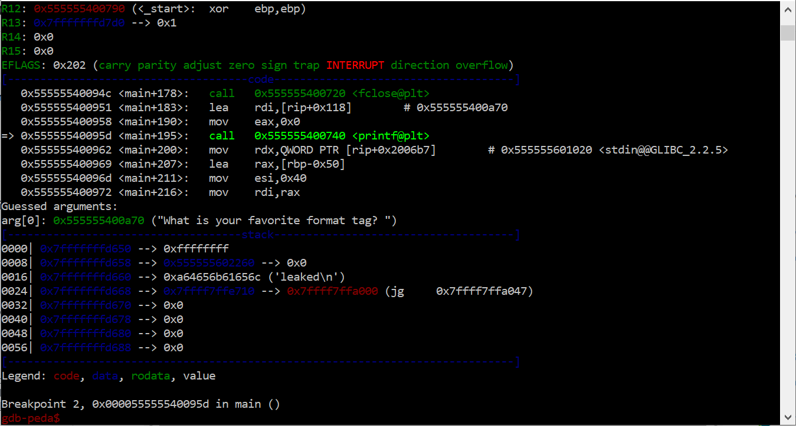
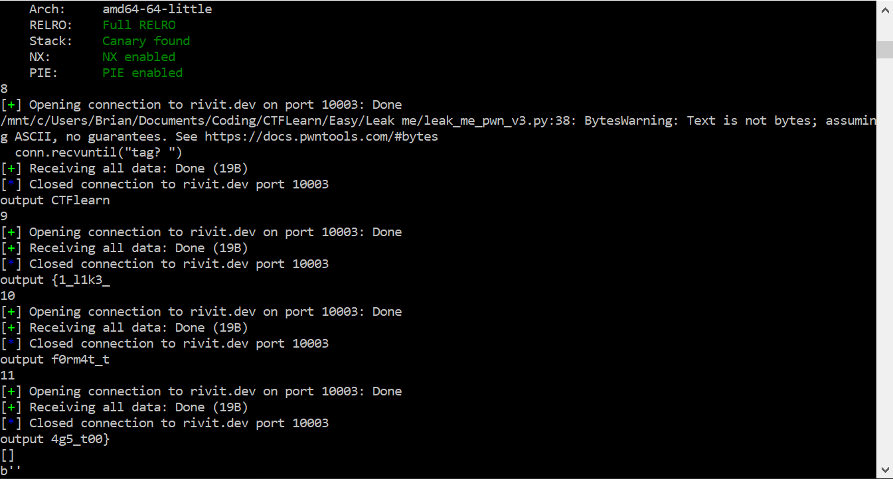

# Leak me

Looking at the code from `task.c`, we can see these two lines:

```
char flag[64], buffer[64];
```

and

```
fgets(buffer, sizeof(buffer), stdin);
```

which will prevent us from carrying out a buffer overflow attack. However, we also notice on line 21:

```
printf(buffer);
```

The `printf` function in C can be used for a format string attack. If we open the `nc` connection and input `ABABABABABAB %p %p %p %p`, we get `ABABABABABAB 0x7900efaecb23 0xfbad208b 0x7900ef9e67e2 (nil)`, meaning that we are successfully reading values off of the stack.

To explore this further, I create a local version of the file with `g++ task.tar/task.c -o task` and create a `flag.txt` file with the content `leaked`. Running this `gdb`, we see the following stack when pausing the run:



With the pertinent line being `0016| 0x7fffffffd660 --> 0xa64656b61656c ('leaked\n')`. We can see that the data is being stored in little endian, so we write `convert_to_string` to get from `0xa64656b61656c` to `leaked\n`.

Now, we just need to find a similar occurence in the `nc` version. For this, I used `pwntools` to fuzz possible outputs, with the final result in `leak_me_pwn_v3.py`, which gave the outputs:



We combine the outputs into `CTFlearn{1_l1k3_f0rm4t_t4g5_t00}`.


Further reading:

[https://shadowintel.medium.com/uncontrolled-format-string-ctf-dec7a9aea747](https://shadowintel.medium.com/uncontrolled-format-string-ctf-dec7a9aea747https:/)

[https://infosecwriteups.com/exploiting-format-string-vulnerability-97e3d588da1b](https://infosecwriteups.com/exploiting-format-string-vulnerability-97e3d588da1b)

[https://ctf101.org/binary-exploitation/what-is-a-format-string-vulnerability/](https://ctf101.org/binary-exploitation/what-is-a-format-string-vulnerability/)

[https://cotonne.github.io/binary/2020/07/14/format-string.html](https://cotonne.github.io/binary/2020/07/14/format-string.htmlhttps:/)

[https://docs.pwntools.com/en/stable/intro.html](https://docs.pwntools.com/en/stable/intro.htmlhttps:/)
