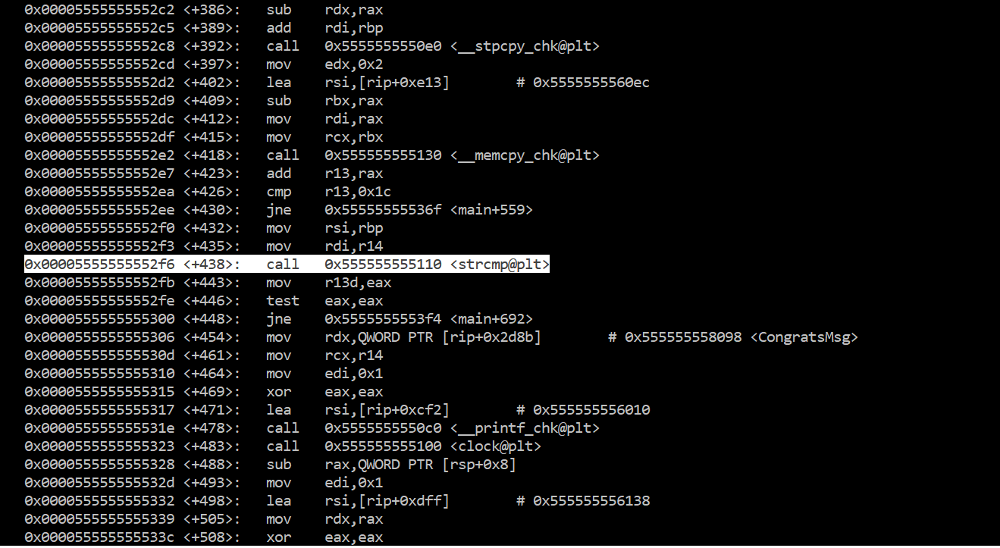
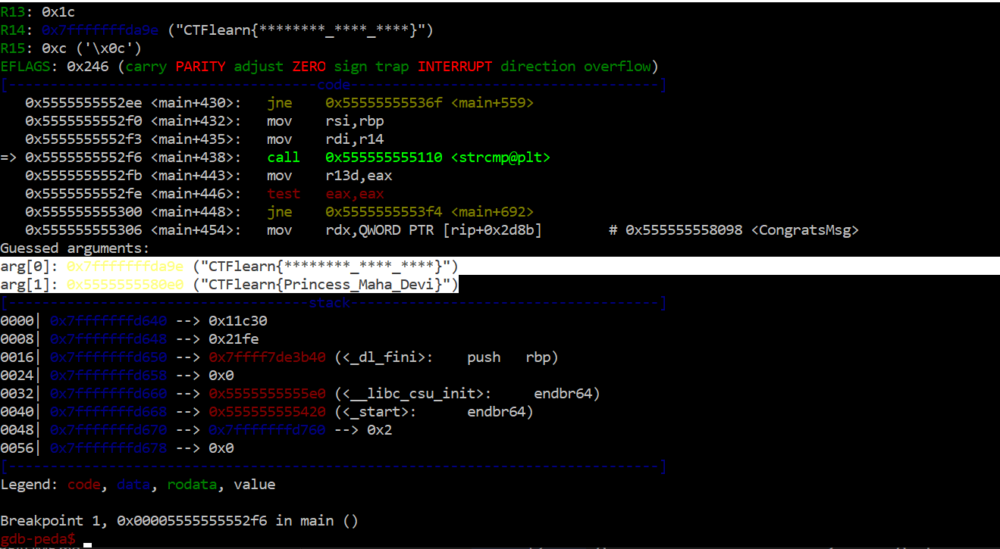
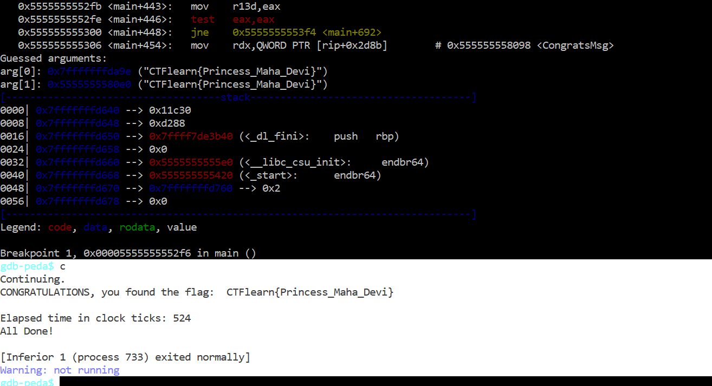

# Rangoon

For this challenge, running the file tells us that we need to enter the correct flag as an argument to the file to get a confirmation from the file. Since we are not given a source file, we will need to decompile the executable we are given.

Executing the file with GDB and running `disas main`, we can see a `strcmp`:

However, adding breakpoint doesn't reveal anything, and we can't seem to find any more useful information through GDB, so we next turn to Ghidra. Disassembling the executable and looking at `main` (provided in `decompile.c` to allow for referencing line numbers), we can try to break down the program.

First, starting from lines 45 to 53, the program seems to pulling the phrase `CTFlearn{` out. It also checks at line 56 that the last character of the line is `}`. Further, line 57 with line 72 and line 58 with line 75 tell us that the characters at indices `0x11` = 11 and `0x16` = 22 must equal `0x5f` = _. Finally, `sVar6` is set to the length of input on line 55 and is compared to `0x1c` = 28 on line 78. This gives us a rough outline of the input string as `CTFlearn{********_****_****}`.

The function `__strcpy_chk` gets called three times, lining up with the three substrings broken up by '_'s. So, we can try to run our program with our practice payload, leaving the original breakpoint set at `strcmp`. If we run this in GDB, we see:

Copying and pastring the comparison string gives us:

So, out flag is: `CTFlearn{Princess_Maha_Devi}`.
